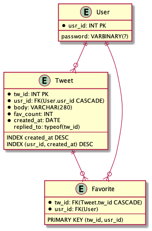

# 8000 requests per second くらいのサービスを作る
大森　章裕 

---
# 自己紹介
## 大森　章裕  
東京工業大学 学部3年生
GitHub: https://github.com/Mojashi
Twitter: @oreha_senpai

- :heart: CTF(web)（最近激アツ）:heart:
- 競技プログラミング
- ボードゲーム
- ボルダリング（最近始めた）
- その他パソコンカタカタ等
---
# もともとできたこと
## webっぽいやつ
- Golang
- React.js
- MySQL
- データベース技術、トランザクションあたりに興味
## それ以外
- アルゴリズム, キカイガクシュー, 言語処理系 etc
---
# いまできること
## webっぽいやつ
- Golang
- React.js
- MySQL
- データベース技術、トランザクションあたりに興味
- <span style="color:red;font-weight:bold;">AWSチョット触れる</span>
- <span style="color:red;font-weight:bold;">負荷試験チョットできる<span>
- <span style="color:red;font-weight:bold;">その他設計や高速化に関する知見など・・・</span>

---
#  Agenda
1. YumetterAPI v1 の仕様を紹介
2. 設計を眺める
3. 負荷試験
4. 改善
5. 所感

    ---
大体作業時系列を追いかける形
随所に得た知見を散りばめていく

---
# 仕様
---
# エンドポイント

<div class="split-v">
<ul>
<li>
<p style="font-weight:bold">
/tweets
</p>
<ul>
    <li class="M-GET M-EP">/</li> 
    <ul><li>全世界タイムライン</li> <li>?replied_to=のクエリパラメータ</li><li>一番重い</li></ul>
    <li class="M-POST M-EP">/</li> ツイートする 
    <li class="M-EP M-GET">/{tw_id}</li> ツイート参照
    <li class="M-EP M-DELETE">/{tw_id}</li> ツイート削除
</ul></li></ul>

<ul>
<li>
<p style="font-weight:bold">
/users
</p>
<ul>
    <li class="M-GET M-EP">/{usr_id}</li>プロフィールを取得
    <li class="M-POST M-EP">/</li> ユーザー登録
    <li class="M-POST M-EP">/users/login</li> ログイン
    <li class="M-GET M-EP">/users/me</li> 
    <li class="M-PATCH M-EP">/users/me</li>
    <li class="M-DELETE M-EP">/users/me</li>
</ul></li></ul>
<ul>
<li>
<p style="font-weight:bold">
/tweets/{tw_id}/favorites
</p>
<ul>
    <li class="M-GET M-EP">/</li> Favの存在を取得
    <li class="M-PUT M-EP">/{usr_id}</li> Favする
    <li class="M-DELETE M-EP">/{usr_id}</li> Fav消す
</ul></li></ul>
</div>
</div>

---
# ER



---
# 設計に関して
```
|-Usecase
    |
    |-mysql
        
|-Repository
```
