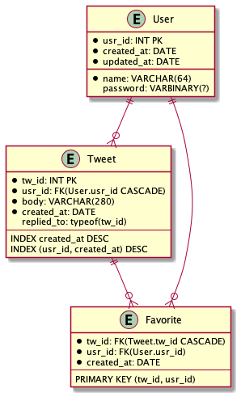

# 8000 requests per second くらいのサービスを作る
大森　章裕 

---
# 自己紹介
## 大森　章裕  
東京工業大学 学部3年生
GitHub: https://github.com/Mojashi
Twitter: @oreha_senpai

- :heart: CTF(web)（最近激アツ）:heart:
- 競技プログラミング
- ボードゲーム
- ボルダリング（最近始めた）
- その他パソコンカタカタ等
---
# もともとできたこと
## webっぽいやつ
- Golang
- React.js
- MySQL
- データベース技術、トランザクションあたりに興味
## それ以外
- アルゴリズム, キカイガクシュー, 言語処理系 etc
---
# いまできること
## webっぽいやつ
- Golang
- React.js
- MySQL
- データベース技術、トランザクションあたりに興味
- AWSチョット触れる
- 負荷試験チョットできる
- その他設計や高速化に関する知見など・・・

---
# やったこと
## **ツイッターライクなAPIを開発**
## **それに大して負荷試験**
## **結果を元にして改善、スケーラビリティーを確認**

---
#  目次
1. YumetterAPI v1 の仕様を紹介
2. 設計を眺める
3. 負荷試験と改善
4. 所感

    ---
大体作業時系列を追いかける形

\
---
# 仕様
---
# エンドポイント

<ul>
<li>

/tweets

<ul>
    <li class="M-GET M-EP">/</li> 
    <ul><li>全世界タイムライン</li> <li>?replied_to=のクエリパラメータ</li><li>一番重い</li></ul>
    <li class="M-POST M-EP">/</li> ツイートする 
    <li class="M-EP M-GET">/{tw_id}</li> ツイート参照
    <li class="M-EP M-DELETE">/{tw_id}</li> ツイート削除
</ul></li></ul>
<ul>
<li>

/users

<ul>
    <li class="M-GET M-EP">/{usr_id}</li>プロフィールを取得
    <li class="M-POST M-EP">/</li> ユーザー登録
    <li class="M-POST M-EP">/users/login</li> ログイン
    <li class="M-GET M-EP">/users/me</li> 
    <li class="M-PATCH M-EP">/users/me</li>
    <li class="M-DELETE M-EP">/users/me</li>
</ul></li></ul>
<ul>
<li>

/tweets/{tw_id}/favorites

<ul>
    <li class="M-GET M-EP">/</li> Favの存在を取得
    <li class="M-PUT M-EP">/{usr_id}</li> Favする
    <li class="M-DELETE M-EP">/{usr_id}</li> Fav消す
</ul></li></ul>

---
# 注目エンドポイント

<li class="M-GET M-EP header" style="width:fit-content">/tweets</li> 
 
<ul>
<li>全世界タイムライン</li> <li>?replied_to=のクエリパメータ</li>
<li>一番重い</li>
<li>レスポンスは、TweetDetailの配列</li>
</ul>

<ul>
<pre>
type TweetDetail struct {
	UserName   model.UserName
	Tweet      model.Tweet
	FavCount   int
	ReplyCount int
	Favorited  bool
}
</pre>
<li>ちょっとTweetのモデルと違う</li>
<li>最初は素直にやっているのでN+1クエリになる</li>
</ul>

---
# ER

---
# アプリ・インフラに際して
- 言語：Golang
- フレームワーク：echo, wire
- データベース：AWS Aurora MySQL 
    - マスター：db.r3.xlarge
    - スレーブ：db.r3.large * 2
- イメージはAWS ECS３台に展開

---
# 設計に関して

<pre>
usecase
├── JWTAuth.go
├── auth.go
└── deleteTweet.go
repository
├── favorite.go
├── mysql
│   ├── favorite.go
│   ├── tweet.go
│   └── user.go
├── tweet.go
└── user.go
handler
├── favorites.go
├── handler.go
├── middleware.go
├── tweets.go
└── users.go
</pre>
<pre>
querier
├── common
│   └── mysql
│       ├── favorite.go
│       ├── tweet.go
│       └── user.go
├── favorite.go
├── findTweetDetails
│   ├── mysql
│   │   ├── findCommonTweetDetails.go
│   │   └── findTweetDetails.go
│   ├── tweetDetail.go
├── findTweetDetails.go
├── tweet.go
└── user.go
</pre> 
<pre>
model
├── errors.go
├── favorite.go
├── tweet.go
└── user.go
db
├── init.sql
├── mysql.go
└── util.go
dataSourceWrapper
├── cache.go
└── dataSource.go
</pre>

---
# 設計に関して

<ul><li>ここら辺は普通</li></pre>

<pre>
usecase
├── JWTAuth.go
├── auth.go
└── deleteTweet.go
repository
├── favorite.go
├── mysql
│   ├── favorite.go
│   ├── tweet.go
│   └── user.go
├── tweet.go
└── user.go
handler
├── favorites.go
├── handler.go
├── middleware.go
├── tweets.go
└── users.go
</pre>
<pre>
model
├── errors.go
├── favorite.go
├── tweet.go
└── user.go
db
├── init.sql
├── mysql.go
└── util.go
dataSourceWrapper
├── cache.go
└── dataSource.go
</pre>

---
# 設計に関して

<ul>
<li>コマンドとクエリは分けた</li>
<ul>
<li>リードレプリカへの接続を導入しようとすると、自然にそうなった</li>
</ul>
<li>GET /tweets に関して処理途中でキャッシュを入れているのでちょっと複雑になっている</li>
</ul>
<pre>
querier
├── common
│   └── mysql
│       ├── favorite.go
│       ├── tweet.go
│       └── user.go
├── favorite.go
├── findTweetDetails
│   ├── mysql
│   │   ├── findCommonTweetDetails.go
│   │   └── findTweetDetails.go
│   ├── tweetDetail.go
├── findTweetDetails.go
├── tweet.go
├── user.go
</pre> 

---
# 負荷試験
---
# シナリオ
1. タイムライン閲覧
2. ユーザー登録、ログイン
3. ツイート
4. タイムラインを見て確率（ツイートIDに対して一意に定まり、偏りがある）で
    - ファボ
    - リプライ
    - そのツイートのリプライを見る

    ---
- 3-5を数回ループ
- だんだんユーザー数が増えていき、かかる負荷が増大する
- basicScenarioと呼称

---
# シナリオについて所感
## ユーザーの行動をシミュレート
- 実際にかかる負荷がそうなんだからそのほうが良いだろ
- 計測結果をベースに改善していくのであれば、そのほうが的外れな改善をしづらい
## 実行が長いシナリオを書くな
- 限界rpsをはかりたいだけの目的なら、という話
- 本当に思った　一回が長いと作業効率がとっても落ちる
- 同じシナリオで測り続けることは別に重要じゃない
    - リクエストの分布が維持されるなら今の性能にアジャストして変えていってよさそう
---
# 初回計測

- 100rpsくらい
- ECS一台 dbも小さいやつ一台

---
# インスタンス拡大後

- 500rpsくらい
- EC三台 DBのCPUがボトルネックに

---
# ツイートのみ

- 2000rpsくらい

---
# ツイート閲覧のみ

- 2000rpsくらい

---
# タイムラインのみ

- 100rpsくらい
- レスポンスタイムも長く、こいつのせいで全体的に性能が最悪になっている
- N+1のエンドポイント

---
# N+1を治す

<ul>
<li>
この時点ではquerierは存在せず、クエリも全部同じ層を通過し、同じモデルを扱っていたので単純なN+1が存在していた。
</li>
<li>
この時はusecaseから直にJOINを投げた
</li>
</ul>
<pre>
type TweetDetail struct {
	UserName   model.UserName
	Tweet      model.Tweet
	FavCount   int
	ReplyCount int
	Favorited  bool
}
</pre>

---
# N+1治る ツイートだけ

- 2000rpsくらい

---
# N+1治る basicScenario

- やけに性能が悪い気がする
- GET /tweets/{tw_id} GET /tweets POST /tweets は2000rpsくらい出てるのに...

---
# Registerだけ

- 200rps
- DBの負荷は POST /tweets と同じくらいなので、アプリが悪い

---
# register調査
- golangのプロファイラといえば、pprof
- bcryptの処理が支配的
- bcryptは求める安全度に応じてコストを操作可能
- ハッシュに、ハッシュされた時のコストなんかが記録されてる！

---
# bcryptのコストを下げた

- 1000rps
- そんなに多くないし許せる！

---
# bcryptのコストを下げた

- 3000rpsくらい？えらい！

---

---
# リードレプリカの作成

- やや伸び・・・
- 結局レプリカ１台作るだけだとオーバーヘッドの方が顕著・・・
- レプリカはスケーラビリティの確認のためにやること

---
# DBコネクションプーリング
## INSERT速度を上げたくて、mysqlのドキュメントを見てみる

MySQL 5.6 リファレンスマニュアル INSERT ステートメントの速度

---
# DBコネクションプーリング

- 5000rps弱
- ちゃんとコネクションプールの数値を設定しよう!
- でも正しい数値ってなんなんだ

---
# 無限のコネクションをプールする

- 処理できるリクエスト数はかなり増えた
- レスポンスタイムはかなり悪化（655ms -> 1750ms 75percentile）
- **コネクションの数は、レスポンスタイムとリクエスト数のトレードオフの調整に使えるのかも**

---
# レプリカを増やす

- 8000rpsくらい
- リードレプリカのCPUネック
- ライターのCPUに余裕がある
    - リーダーとトレードオフしたい！

---
# カウントをトリガーでやっちゃう

- rpsは伸びてない

---
# カウントをトリガーでやっちゃう

- レスポンスタイムは改善した
- ライターインスタンスのCPUがネックに

---
# トリガーに関して
## トリガーに頼るのは結構欠点が多い
- INSERTパフォーマンスのそこそこの劣化
    - マスターに負荷が行くのはスケーラビリティにとって痛い
- 処理がアプリと分散してしまうのを気にするひともいる
    - 集計機能とかに専念してビジネスロジックが入り込まないならアリだと僕は思う
- デッドロック起きがち

### 頼らざる負えない状況もある
- リアルタイムな整合性が必要な場合
    - カウントは多くの場合、要求する整合性は低そう
- 今回はredisなんかでカウントした方がよかった

---
# 負荷試験所感1
- **レスポンスタイム**
    - 指標として何を採用するか難しい
        - 70パーセンタイル、90パーセンタイル
- **限界のrps**
    - 安定していた、指標として明確
- **処理できたリクエスト数**
    - シナリオによるが、指標として全然安定していない
    - だんだん負荷を強めていって途中でハングするようなシナリオだと特に

**それぞれ影響があるが別々の指標、これらの中でトレードオフが存在している**

---
# 負荷試験所感2
## 再現性がなかなか無い
- **データベースのインスタンスのキャッシュ**
    - やっぱり起動直後は微妙に悪かった
    - 終了時にinnodb_bufferの中身をダンプ、開始時に読み込むオプションとかある
- **ECSのインスタンスのキャッシュ**(今回はなかった)
- **データベースの中身**
    - 結構顕著だった、２回くらい測ると数百rps落ちている気がする・・・
    - 毎回スナップショットから持って来れたらサイコーだが、無理
    - 初期投入データを莫大な量にすることで解決
    
- **まず安定した指標を選ぶ必要がある**

---
# 負荷試験所感３
## ちゃんと結果を管理する（当たり前）
- コミットハッシュと共に、Gatlingのレポートを管理していたら良かった・・・
- ただ、GatlingのレポートってHTMLなんですよね
- 手元ではサーバー立てて、Chrome拡張の付箋でメモっていた
## そんなに時間がかからないが、十分限界のrpsを観測できるシナリオを作ることは作業効率の上で大事
- 再現性が微妙なので、ちゃんとしようと思うと何回か回したい
    - 予想より時間がかかる
## シナリオは途中で変えていい
- 最初の方の結果と比較できることは別に大事ではない
    -  めっちゃ前の結果は環境が変化しているから

---
# まとめ
## GOOD
- お金で殴ることは実は割と効率がいいことを知った
- CQRSとかアーキテクチャに関して色々調べ、考え、ちょっとだけ実装に落とせた
- 会社のお金をじゃぶじゃぶ使ってAWSの機能を色々触れてとっても良い経験だった
    - なかなか個人で体験できる範囲ではなかったと思う
    - 計算資源もそうだが、ログやメトリクス管理など
## BAD
- あんまり非自明な改善ができなかった
- INSERTの改善ができなかった
    - INSERTをアプリ側でまとめてバルクインサートしようとしたが、DELETEがある都合上一貫性が壊れてしまう
- コミットの粒度,コミットメッセージが改善しなかった
    - 特に実験系のコミットって雑になりがちじゃ無いですか？
- 業務時間に寝た
